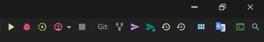
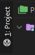
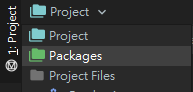
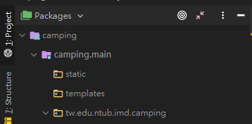
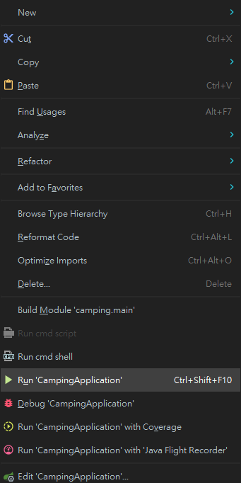
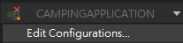
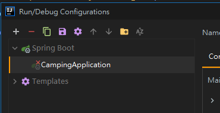
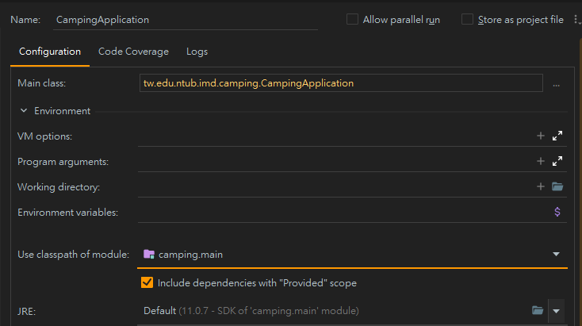
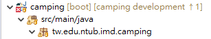
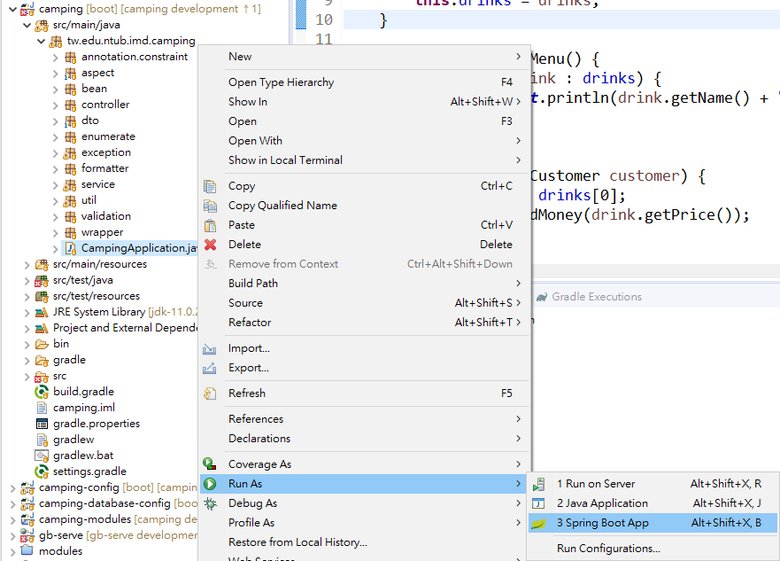

# 國立臺北商業大學資訊管理系專題 - 109409組

- [Notion版README](https://www.notion.so/109409-8f956a76d9b143b18840aaa1ddd2098f)
- [初次開啟專案的事前準備](./get-start.md)
- [API列表](http://211.75.1.201:50004/api)
- [問題回報](https://github.com/ntubimd/camping-backend/issues/new)

## 專案環境

- 程式語言：Java
- JDK版本：AdoptOpenJDK 11.0.8+10(JVM：HotSpot)
- 框架：SpringBoot 2.3.1.RELEASE
- ORM：Hibernate 5.4.17.Final
- JPA StaticMetadata Generator：org.hibernate:hibernate-jpamodelgen:5.4.20.Final

## 專案設定

1. 複製`/src/main/resources/application-server.yml`並重新命名為`application-local.yml`
2. 開啟新複製的`application-local.yml`並在最底下新增以下變數

    ```yaml
    camping:
      database:
        url: jdbc:log4jdbc:mysql://localhost:3306/camping?useSSL=false&serverTimezone=Asia/Taipei
        account: {你的資料庫帳號，一般為root，如果你看到我，就表示你沒有改成自己的}
        password: {你的資料庫密碼，如果你看到我，就表示你沒有改成自己的}
      credit-card-api:
        base-url: http://localhost:8081
    ```

    此檔案中的所有變數值皆可改成個人習慣，但不可移除變數

## 專案啟動

- CMD、Terminal
    1. 切換目錄至專案根目錄
    2. Windows輸入`gradlew.bat bootrun`，Linux、Mac輸入`gradlew bootrun`
- IDE
    - Jetbrains IntelliJ IDEA

        開啟專案後，點擊右上方的執行按鈕即可(綠色箭頭，紅色蟲子左邊)

        

        - 錯誤排除
            - 執行按鈕左側顯示`ADD CONFIGURATION...`
                1. 點選左側的專案視窗

                    

                2. 點選他旁邊的下拉選單，選擇`Packages`

                    

                3. 展開`camping`、`camping.main`、`tw.edu.ntub.imd.camping`

                    

                4. 對`CampingApplication`點右鍵，選擇`Run 'CampingApplication'`即可解決

                    

            - 執行按鈕左側顯示以下畫面

                

                1. 點此下拉選單，選擇`Edit Configurations...`

                    

                2. 左半邊展開`Spring Boot`並選擇`CampingApplication`

                    

                3. 右半邊需確定以下幾點
                    1. `Main Class`為`tw.edu.ntub.imd.camping.CampingApplication`，若否，請點選其右方的三個點，選擇`CampingApplication`

                        

                    2. 展開`Main Class`底下的`Environment`，確定`Use classpath of module`選擇的是`camping.main`

                        

    - Eclipse

        1. 依序展開：`camping、src/main/java、tw.edu.ntub.imd.camping`

            

        2. 對著`CampingApplication.java`點右鍵，選擇`Run As → 3 Spring Boot App`即可

            

- 常見通用問題

## 專案負責人員

|  姓名  |         信箱         |
|:------:|:--------------------:|
| 李恩瑋 | 10646007@ntub.edu.tw |
| 黃峻彥 | 10646003@ntub.edu.tw |
