# 國立臺北商業大學資訊管理系專題 - 109409組

- [Notion版README](https://www.notion.so/109409-8f956a76d9b143b18840aaa1ddd2098f)
- [API列表](http://211.75.1.201:50004/api)
- [問題回報](https://github.com/ntubimd/camping-backend/issues/new)

## 專案環境

- 程式語言：Java
- JDK版本：AdoptOpenJDK 11.0.8+10(JVM：HotSpot)
- 框架：SpringBoot 2.3.1.RELEASE
- ORM：Hibernate 5.4.17.Final
- JPA StaticMetadata Generator：org.hibernate:hibernate-jpamodelgen:5.4.20.Final

## 啟動專案伺服器

### 事前準備

- Java(如果您已經擁有JDK 11的任意版本，可略過此步驟)
    1. 安裝OpenJDK，版本：AdoptOpenJDK 11.0.8+10(JVM：HotSpot)
        - Windows
            - x86：[msi](https://github.com/AdoptOpenJDK/openjdk11-binaries/releases/download/jdk-11.0.8%2B10/OpenJDK11U-jdk_x86-32_windows_hotspot_11.0.8_10.msi)、[zip](https://github.com/AdoptOpenJDK/openjdk11-binaries/releases/download/jdk-11.0.8%2B10/OpenJDK11U-jdk_x86-32_windows_hotspot_11.0.8_10.zip)
            - x64：[msi](https://github.com/AdoptOpenJDK/openjdk11-binaries/releases/download/jdk-11.0.8%2B10/OpenJDK11U-jdk_x64_windows_hotspot_11.0.8_10.msi)、[zip](https://github.com/AdoptOpenJDK/openjdk11-binaries/releases/download/jdk-11.0.8%2B10/OpenJDK11U-jdk_x64_windows_hotspot_11.0.8_10.zip)
        - [Linux](https://github.com/AdoptOpenJDK/openjdk11-binaries/releases/download/jdk-11.0.8%2B10/OpenJDK11U-jdk_x64_linux_hotspot_11.0.8_10.tar.gz)
        - macOS：[pkg](https://github.com/AdoptOpenJDK/openjdk11-binaries/releases/download/jdk-11.0.8%2B10/OpenJDK11U-jdk_x64_mac_hotspot_11.0.8_10.pkg)、[tar.gz](https://github.com/AdoptOpenJDK/openjdk11-binaries/releases/download/jdk-11.0.8%2B10/OpenJDK11U-jdk_x64_mac_hotspot_11.0.8_10.tar.gz)
    2. 請至專案根目錄(與`build.gradle`同層)下自行建立`gradle.properties`檔案，檔案內容如下

        ```
        org.gradle.java.home={你的JDK 11目錄，如果你看到我，就表示你沒有改成自己的}
        ```

- 資料庫
    1. [下載MySQL資料庫](https://downloads.mysql.com/archives/installer/)(Windows) (如果您已經擁有MySQL 8的任意版本Server，可略過此步驟)
    2. 下載專案資料庫備份檔(目前為1.2.5版)

        [camping(structure)-1.2.5.sql](./README-media/camping(structure)-1.2.5.sql)

    3. 啟動`MySQL Workbench`，選擇左上方`Server → Data Import`

        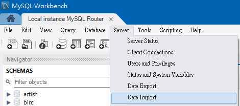

    4. 在`Import Options`區塊中選擇第二個選項(`Radio Button`)，並點選其最後面的按鈕，選擇第二點下載的`.sql`檔
    5. 點選右下方的`Start Import`按鈕即可完成備份(注：若無找到`Start Import`，需要調高螢幕解析度，1920x1080最佳)
- 環境變數
    - Windows
        1. 開啟檔案總管：對本機點右鍵，選擇最後的"內容"

            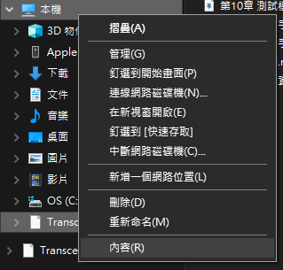

        2. 選擇左上方的"進階系統設定"

            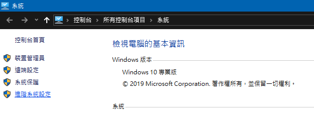

        3. 選擇"環境變數"
        4. 在"系統變數"區塊選擇"新增"(即由上往下數的第二個"新增"按鈕，或者說"確定"按鈕的左上方那顆"新增"按鈕)

            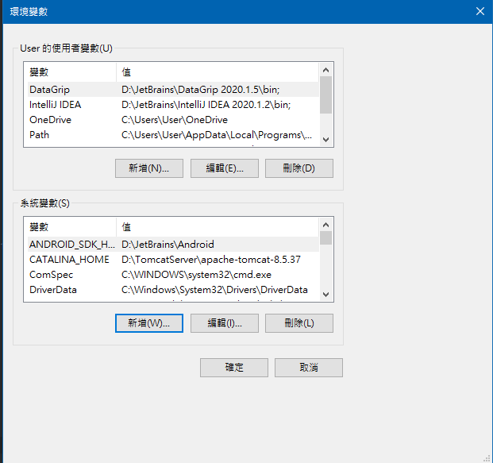

        5. 在變數名稱區塊輸入"`log.path`"，變數值區塊輸入伺服器運行日誌的存放資料夾，我會自動在該資料夾下建立名為"`camping`"(專案名稱)的資料夾，可以用相對(以專案根目錄來說)或絕對路徑來設定

            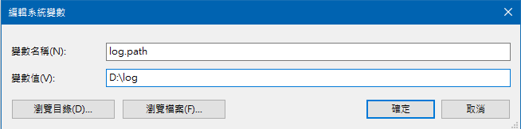

        6. 設定完成即可依序點選"確定"按鈕關閉視窗
        7. 若此時您的IDE或CMD是啟動狀態，請重新啟動IDE或CMD(需關閉所有IDE或CMD視窗後再重新啟動)
    - Linux & Mac

        我沒有用Linux或Mac，所以請自行上網尋找設定方式

        1. 變數名稱：`log.path`
        2. 變數值請自行設定，變數值的意義為設定伺服器運行日誌的存放資料夾，我會自動在該資料夾下建立名為"`camping`"(專案名稱)的資料夾，可以用相對(以專案根目錄來說)或絕對路徑來設定
- IDE
    - Jetbrains IntelliJ IDEA (截圖版本為2020.2.2，且介面有套用`Material Theme`)
        - 開啟專案
            - 歡迎頁面
                1. 選擇`Open or Import`

                    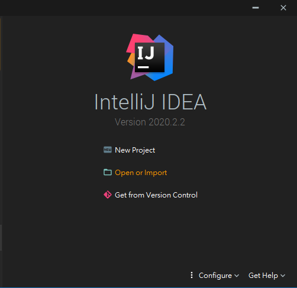

                2. 選擇專案根目錄後，選擇`Ok`即可
            - 已開啟其他專案
                1. 選擇左上方的File，在下拉選單中選擇`Open...`

                    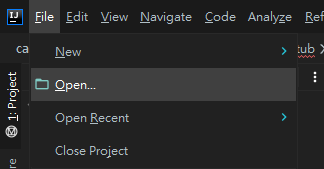

                2. 選擇專案根目錄後，選擇`Ok`即可
        - JDK
            1. 請按鍵盤上的`Ctrl + Alt + Shift + S`開啟專案設定視窗

                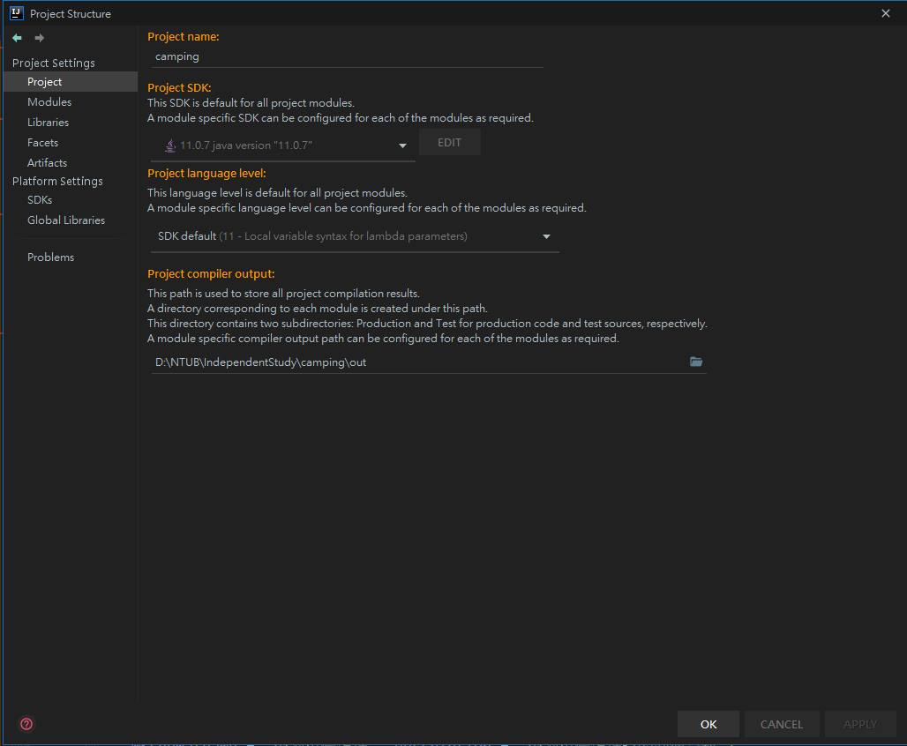

            2. 在`Project SDK:`處的下拉選單中選擇11.X.X版的JDK

                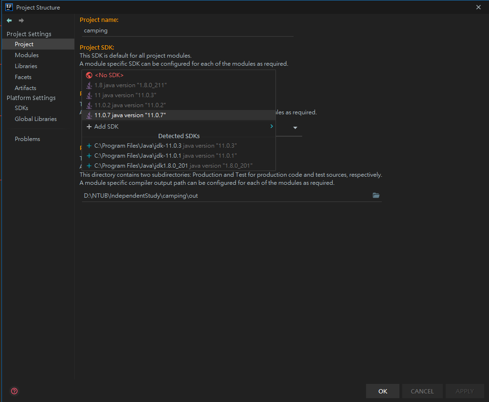

            3. 若找不到11.X.X版的JDK，請點選空白處關閉下拉選單，並選擇下拉選單旁的`EDIT`按鈕

                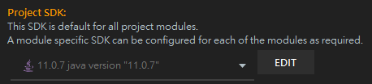

            4. 點選左上方的"+"號

                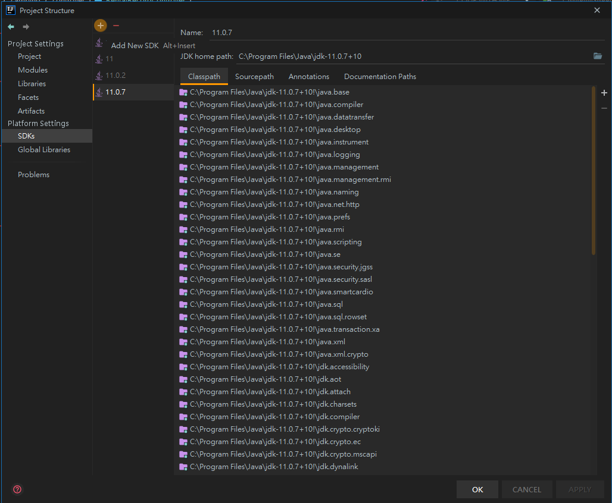

            5. 選擇`Add JDK...`

                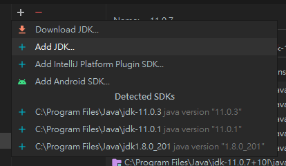

            6. 選擇JDK根目錄後點選`OK`按鈕關閉選擇
            7. 點選左側導覽列的`Project`並在`Project SDK`的下拉選單中選擇剛剛新加入的JDK即可點選右下方的`OK`按鈕關閉視窗即可
        - Lombok
            - 歡迎頁面
                1. 選擇右下方的`Configure`
                2. 點選第二項：`Plugins`

                    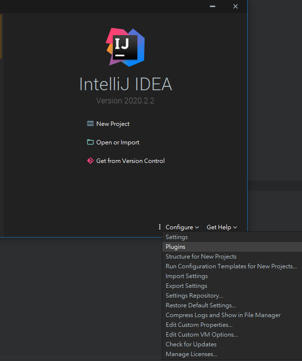

                3. 中間上方選擇`Marketplace`

                    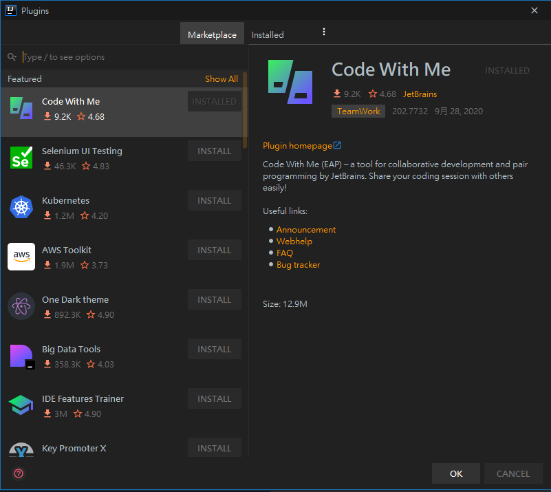

                4. 在搜尋欄中輸入：`Lombok`

                    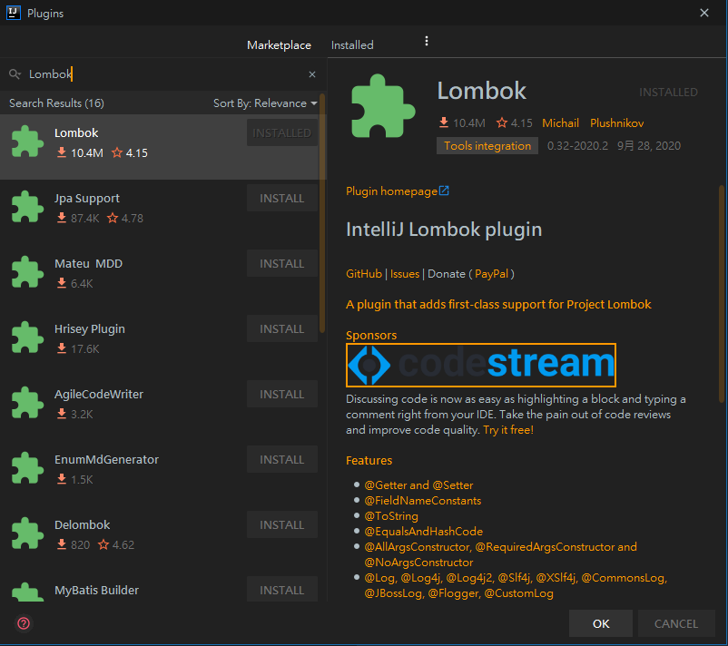

                5. 下載第一個插件即可
            - 已開啟其他專案
                1. 請按鍵盤上的`Ctrl + Alt + S`開啟IDE設定視窗
                2. 點選視窗左方列表的`Plugins`

                    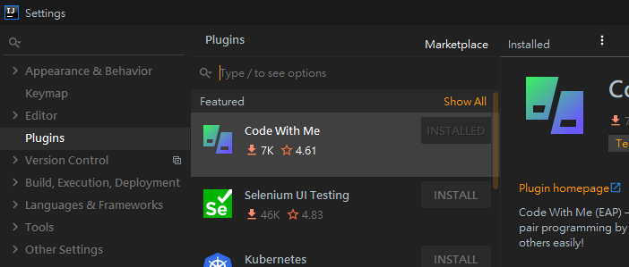

                3. 在上圖右上方中選擇`Marketplace`
                4. 在上圖中間上方的搜尋欄中輸入：`Lombok`

                    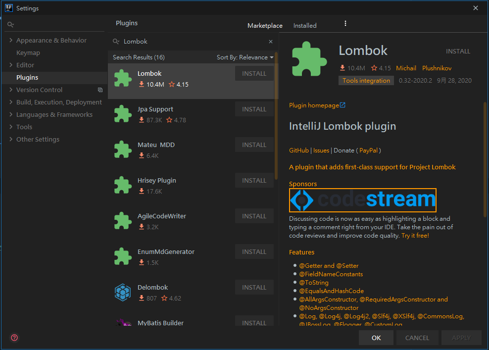

                5. 下載上圖中的第一個插件，下載完成後重啟IDE
                6. 重啟完畢後，右下方會跳出一個視窗詢問是否啟用`Lombok`設定，展開後選擇`Enable`即可

                    

                    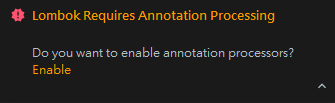

    - Eclipse(截圖版本為2020.2)
        - 插件安裝
            1. 選擇選單列最右方的`Help → Eclipse Marketplace...`
            2. 搜尋`Gradle`並下載`Gradle IDE Pack`

                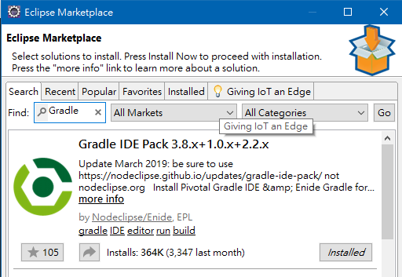

            3. 點選下載後會在背景下載(右下角會有讀條)，安裝完畢後重複第一步，改成搜尋Spring STS並下載`Spring Tools 4 (aka Spring Tool Suite)`

                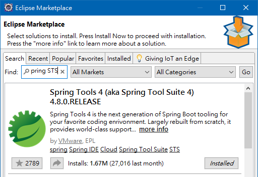

            - 若找不到以上兩個或其中一個
                1. 請打開瀏覽器搜尋`Eclipse + 插件名稱`，例如：Eclipse Gradle IDE Pack

                    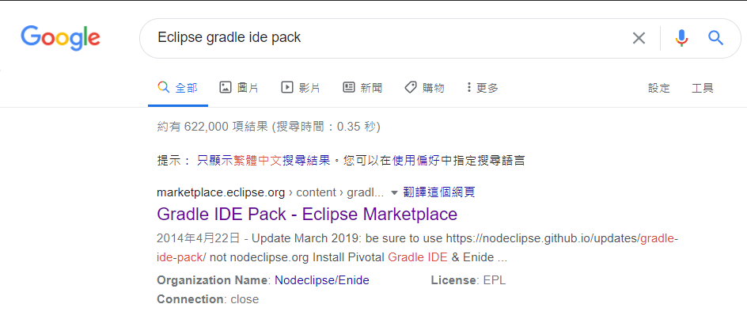

                2. 點進標題有`Eclipse Marketplace`的網站
                3. 點擊`Install`按鈕下方一排`icon`的最右邊那個按鈕

                    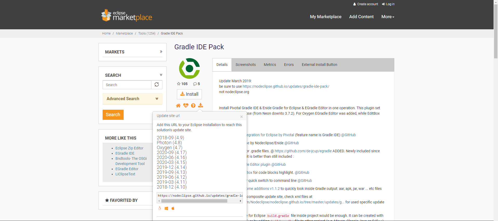

                4. 請確認`Eclipse`版本(如果沒有就挑最接近的)並複製其下方的網址
                5. 回到`Eclipse`，選擇選單列最右方的`Help → Install New Software...`

                    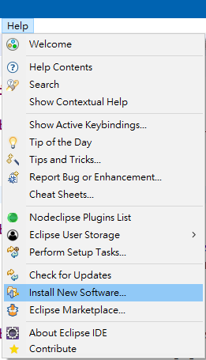

                6. 將第四步複製的網址貼到第一個輸入框中，下方的列表會自己多出幾個選項，若沒有出現，可自行按`Enter`

                    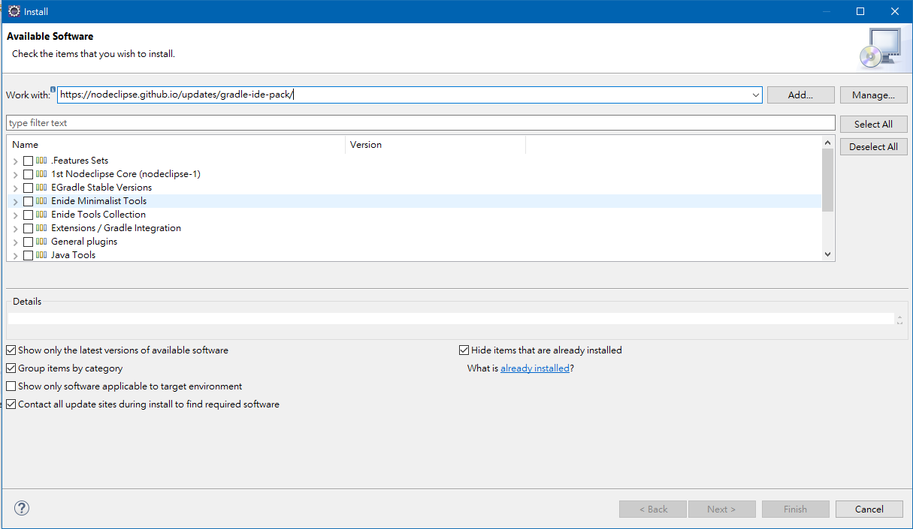

                7. 將列表出現的項目全選，可點右上方的`Select All`按鈕
                8. 點擊右下方的`Next >`按鈕即可開始安裝
        - 開啟專案
            1. 選擇選單列`File → import...`

                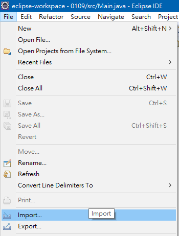

            2. 選擇`Gradle → Existing Gradle Project`

                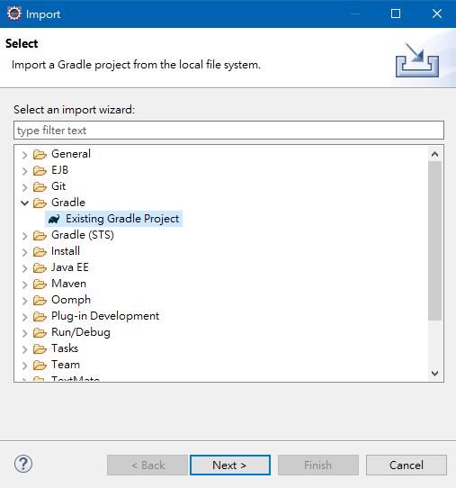

            3. 選`Next >`兩次，看到以下畫面

                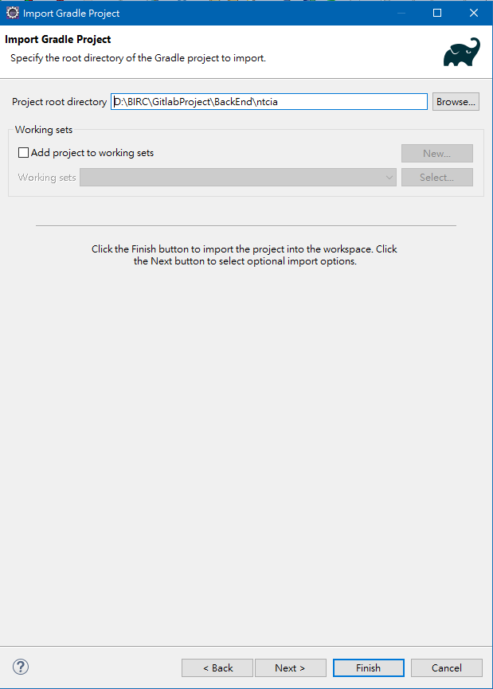

            4. 將`Project root directory`選至專案根目錄，可用最右方的`Browse...`按鈕選擇
            5. 點右下方的`Next >`
            6. 將`Override workspace settings`打勾後選右下方的`Next >`

                

            7. 等待數秒後會在中間區塊列出他偵測到的專案有哪些，確認無誤後即可點右下方的`Finish`結束`import`

                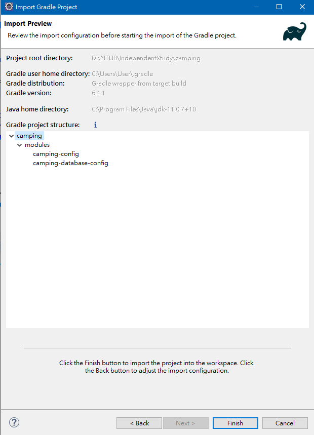

            8. 在專案視窗中會多出以下幾個專案

                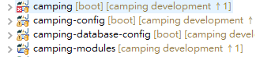

        - JDK
            1. 對專案點右鍵，在選單中用滑鼠指著`Build Path >` Configure Build Path...

                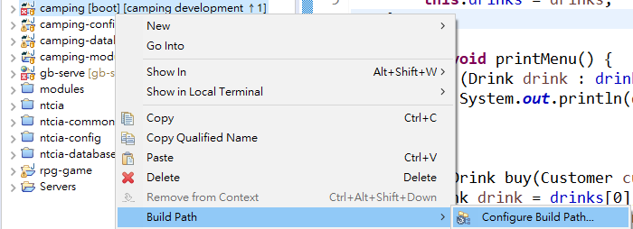

            2. 選擇中間上方的Library

                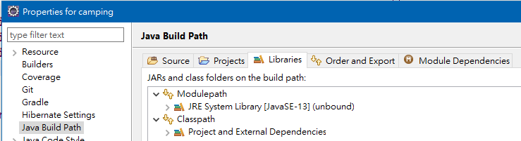

            3. 點擊下方的`JRE System Library`，並選擇右下方的`Edit`按鈕

                

            4. 選擇第二項`Alternate JRE`，並在旁邊的下拉選單選擇JDK 11，選擇好後即可按`Finish`、`Apply and Close`

                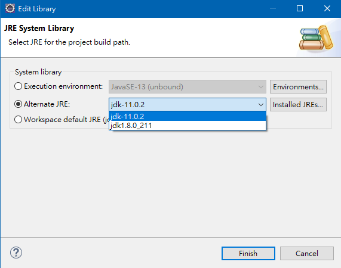

                1. 若下拉選單中找不到JDK，可點選旁邊的`Installed JREs...`，再點選右方的`Add...`按鈕

                    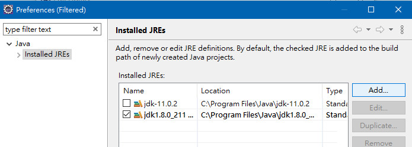

                2. 選擇`Standard VM`(理論上是預設)後，點下方的`Next >`按鈕

                    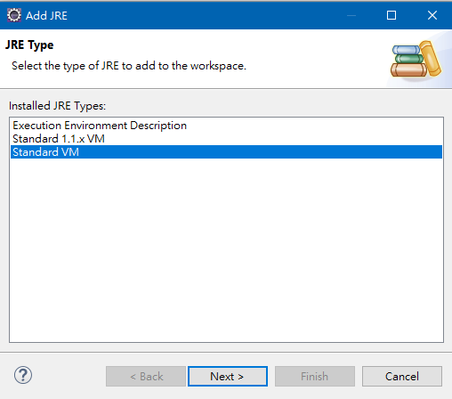

                3. `JRE home`選至JDK根目錄後(可用右上方的`Directory...`選擇)，點擊下方`Finish`，接著選`Apply and Close`，下拉選單就會多出剛剛的JDK了

                    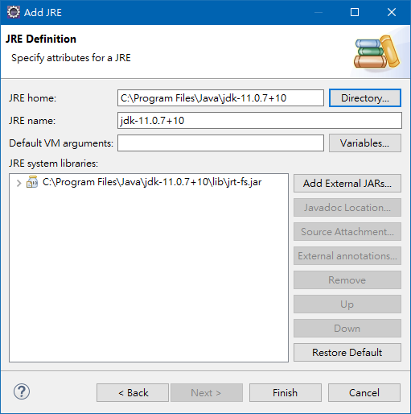

        - Lombok
            1. 至`Lombok`官網[下載](https://projectlombok.org/download)最新版本(撰寫時最新版為：1.8.12)
            2. 點擊下載下來的`lombok.jar`
            3. 等待數秒後，中間的區塊會列出您電腦上所有安裝的`Eclipse`存放位置(若`Eclipse`已安裝過`Lombok`，則在路徑旁會有一根辣椒)

                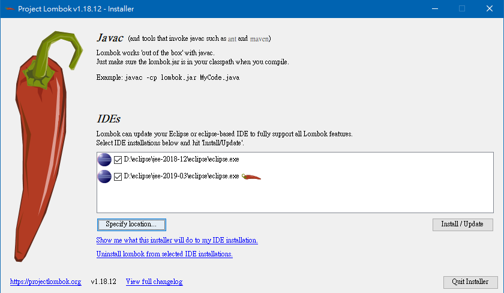

            4. 選擇要安裝`Lombok`的`Eclipse`後，點擊右下方的`Install / Update`開始安裝
            5. 出現以下畫面表示安裝成功，需重啟`Eclipse`才會生效

                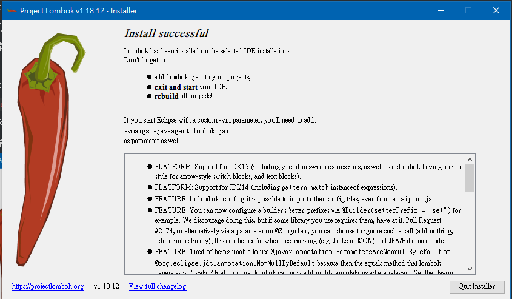

### 專案設定

1. 複製`/src/main/resources/application-server.yml`並重新命名為`application-local.yml`
2. 開啟新複製的`application-local.yml`並在最底下新增以下變數

    ```yaml
    camping:
      database:
        url: jdbc:log4jdbc:mysql://localhost:3306/camping?useSSL=false&serverTimezone=Asia/Taipei
        account: {你的資料庫帳號，一般為root，如果你看到我，就表示你沒有改成自己的}
        password: {你的資料庫密碼，如果你看到我，就表示你沒有改成自己的}
      credit-card-api:
        base-url: http://localhost:8081
    ```

    此檔案中的所有變數值皆可改成個人習慣，但不可移除變數

### 專案啟動

- CMD、Terminal
    1. 切換目錄至專案根目錄
    2. Windows輸入`gradlew.bat bootrun`，Linux、Mac輸入`gradlew bootrun`
- IDE
    - Jetbrains IntelliJ IDEA

        開啟專案後，點擊右上方的執行按鈕即可(綠色箭頭，紅色蟲子左邊)

        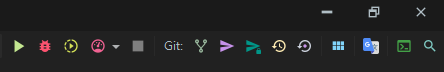

        - 錯誤排除
            - 執行按鈕左側顯示`ADD CONFIGURATION...`
                1. 點選左側的專案視窗

                    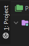

                2. 點選他旁邊的下拉選單，選擇`Packages`

                    

                3. 展開`camping`、`camping.main`、`tw.edu.ntub.imd.camping`

                    

                4. 對`CampingApplication`點右鍵，選擇`Run 'CampingApplication'`即可解決

                    

            - 執行按鈕左側顯示以下畫面

                

                1. 點此下拉選單，選擇`Edit Configurations...`

                    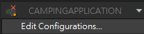

                2. 左半邊展開`Spring Boot`並選擇`CampingApplication`

                    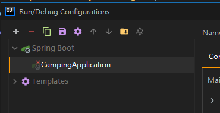

                3. 右半邊需確定以下幾點
                    1. `Main Class`為`tw.edu.ntub.imd.camping.CampingApplication`，若否，請點選其右方的三個點，選擇`CampingApplication`

                        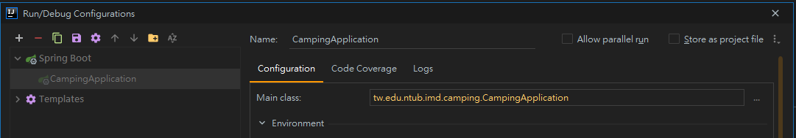

                    2. 展開`Main Class`底下的`Environment`，確定`Use classpath of module`選擇的是`camping.main`

                        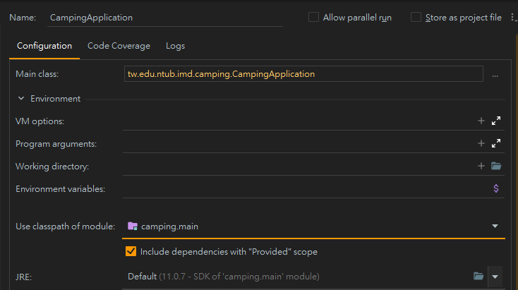

    - Eclipse

        1. 依序展開：`camping、src/main/java、tw.edu.ntub.imd.camping`

            

        2. 對著`CampingApplication.java`點右鍵，選擇`Run As → 3 Spring Boot App`即可

            

- 常見通用問題

### 專案負責人員

|  姓名  |         信箱         |
|:------:|:--------------------:|
| 李恩瑋 | 10646007@ntub.edu.tw |
| 黃峻彥 | 10646003@ntub.edu.tw |
